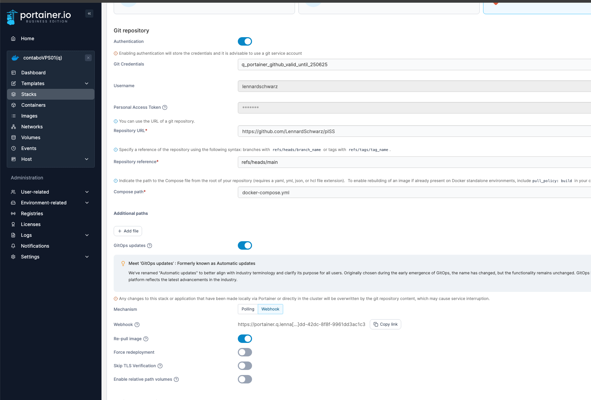

# pISS

[piss.lenn.rocks](https://piss.lenn.rocks) shows the current urine tank level of the ISS Space Station.

It uses NASA's official public ISS telemetry stream via [Lightstreamer](https://lightstreamer.com/).

## Inspirations

This project was inspired by:

- https://github.com/Jaennaet/pISSStream
- https://www.telemetry.space/
- https://iss-mimic.github.io/Mimic/

## Deployment Instructions

#### Portainer

#### Set Github Secrets

See [gh action deploy.yml](.github/workflows/deploy.yml).

#### DNS

Set DNS entries for website.
